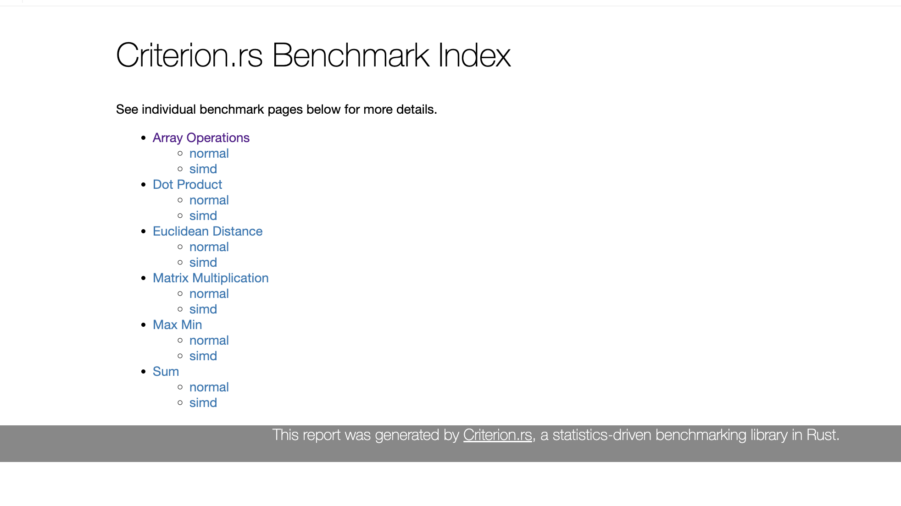

# SIMD vs Scalar Benchmarks in Rust

A benchmarking suite comparing scalar (normal) implementations against SIMD (Single Instruction, Multiple Data) vectorized implementations in Rust using the portable SIMD API.

## Benchmark Results



### Performance Comparison

| Operation | Normal (ns) | SIMD (ns) | Speedup | Winner |
|-----------|-------------|-----------|---------|--------|
| **Sum** | 1.63 | 30.68 | 0.05x | ❌ Normal |
| **Dot Product** | 60.57 | 2.69 | **22.5x** | ✅ SIMD |
| **Array Operations** | 952.13 | 4.83 | **197x** | ✅ SIMD |
| **Max/Min** | 8.83 | 1.71 | **5.2x** | ✅ SIMD |
| **Matrix Multiply** | 8.32 | 9.08 | 0.92x | ❌ Normal |
| **Euclidean Distance** | 9.61 | 2.32 | **4.1x** | ✅ SIMD |

### Key Insights

- **SIMD excels** at element-wise array operations (up to 197x faster!)
- **SIMD struggles** with tiny operations where overhead exceeds benefits
- **Data size matters** - SIMD benefits increase with larger datasets
- **Memory layout matters** - contiguous data structures perform better

## What This Project Demonstrates

This project benchmarks common computational operations to show where SIMD vectorization provides real-world performance improvements:

1. **Simple Arithmetic** - Basic addition operations
2. **Vector Operations** - Dot products and element-wise operations
3. **Array Manipulation** - Add, subtract, multiply operations
4. **Reduction Operations** - Finding min/max values
5. **Matrix Mathematics** - 4x4 matrix multiplication
6. **Distance Calculations** - Euclidean distance in 4D space

## Technologies Used

- **Rust Nightly** - Required for portable SIMD features
- **Portable SIMD** (`std::simd`) - Rust's cross-platform SIMD API
- **Criterion.rs** - Statistical benchmarking framework


## 🚀 Getting Started

### Installation

1. Clone the repository:
```bash
git clone git@github.com:D-Lite/simd-check.git
cd simd-check
```

2. Ensure you're using Rust nightly (the `rust-toolchain.toml` handles this automatically)

### Running the Examples

To see all implementations in action:
```bash
cargo run
```

### Running Benchmarks

To run the full benchmark suite:
```bash
cargo bench
```

The benchmark results will be:
- Printed to the terminal with statistical analysis
- Saved as HTML reports in `target/criterion/report/index.html`
- Include comparison graphs and performance metrics

### Viewing Benchmark Reports

After running benchmarks, open the generated HTML report:
```bash
open target/criterion/report/index.html  # macOS
xdg-open target/criterion/report/index.html  # Linux
start target/criterion/report/index.html  # Windows
```

## Learn More

- [Rust Portable SIMD Documentation](https://rust-lang.github.io/portable-simd/core_simd/simd/index.html)
- [Criterion.rs Documentation](https://bheisler.github.io/criterion.rs/book/)
- [Vector Programming with SIMD](https://www.youtube.com/watch?v=XvL5j2kYJL4)

## Contributing

Feel free to add more benchmark scenarios! Some ideas:
- Image processing operations
- String manipulation
- Sorting algorithms
- Cryptographic operations
- Audio/signal processing

## License

MIT License - feel free to use this for learning and experimentation!

## ⚠️ Notes

- This uses unstable Rust features (`portable_simd`)
- Benchmarks are hardware-dependent (your results may vary)
- Small datasets may not show SIMD advantages due to overhead
- Always profile real-world workloads, not just microbenchmarks

---

**Built with** ❤️ **Daniel Olabemiwo to explore the power of SIMD**
